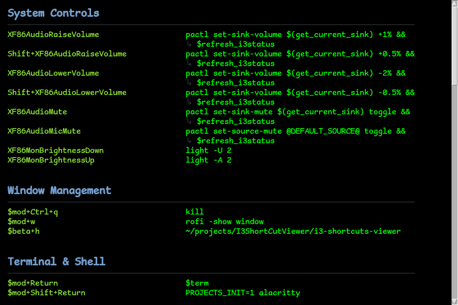

# Shortcut Viewer

## Introduction

This application displays i3 window manager shortcuts without needing to look at the shortcuts file directly. The shortcuts file is stored in `~/.config/i3/shortcuts`. The UI provides a clean interface for viewing shortcuts.

Categories are marked by triple comments `(###)`. In the UI, the font used for category headings is larger than the regular font.

The shortcuts UI in the shortcuts viewer can be searched using the `/` key.

The UI reads and parses the alacritty.toml file for main colors and font. The background matches the terminal background, and the font matches the terminal font. This is a dynamic process which reads the alacritty config file at startup and initializes the colors that are used by the application. Only the colors are inherited, not the font size.

A configuration file is read from either `i3-shortcut-viewer.toml` in the current directory or `~/.config/i3-shortcut-viewer/config.toml`. It allows the user to configure the font size used for the application via a `[font] size = ...` parameter.

By default text doesn't overflow. The window expands to fit the length of the shortcut commands OR wraps over. A "`wrap_command`" option in the config file configures this. Wrapping behaviour ensures that the command text remains in the right hand column as opposed to wrapping at the very left where the key binding is. Where text has wrapped, there is an indicator at the left that's an arrow emoji pointing down then right that is stripped when copying. These likewise do not start at the very left and instead stay in the column of the command. The arrow starts in the right hand side column where the command text starts instead of starting in the left hand side column under where the keybinding is declared.

Scrolling is possible using the mouse, arrow keys, page up buttons and C-n and C-p keys (emacs). Scrolling feels fluid and soft like in a web browser as opposed to being done in jumps.

Pressing the escape key exits the application.

Hovering over the command of a keybinding highlights the entire row. Clicking on such a row executes the command.



## Preparing your Shortcuts File

This script works better when shortcuts are categorised.

Separate the user shortcuts into a smaller "shortcuts" file that is imported from the main i3 config file as follows:

    include shortcuts

An agent can look at the config file, reproduce it with everything categorised under `(###)` headers and make a python script that ensures that no shortcuts have been left behind by the categorisation. The new file is then copied to the shortcuts file.

---

**Note:** All of the code in this project was generated by Claude based on iterating on the specification above. The content below was also generated by Claude to help potential users.

---

## Getting Started

### Requirements

- Python 3
- Tkinter (usually included with Python)
- Alacritty terminal emulator (for theme inheritance)

### Installation

1. Clone or download this repository
2. Ensure you have a shortcuts file at `~/.config/i3/shortcuts`
3. Run the viewer:

```bash
python3 viewer.py
```

Or use the launcher script:

```bash
./i3-shortcuts-viewer
```

### i3 Integration

Add this line to your i3 config file (typically `~/.config/i3/config`):

```
bindsym $mod+slash exec /path/to/I3ShortCutViewer/i3-shortcuts-viewer
```

Replace `/path/to/I3ShortCutViewer` with the actual path to this project.

Then reload i3 config with `$mod+Shift+r`.

Now press `$mod+/` to view your shortcuts anytime.

### Keybindings

- `/` - Open search bar
- `n` - Next search result
- `N` - Previous search result
- `Enter` - Next search result (when in search bar)
- `Escape` - Close search bar (or close window if search is not active)
- Arrow keys, Page Up/Down, Ctrl-n/Ctrl-p - Scroll through shortcuts

### Configuration

Create a `config.toml` file in one of these locations (checked in order):

1. Same directory as the script: `./config.toml`
2. User config directory: `~/.config/i3-shortcut-viewer/config.toml`

Example configuration:

```toml
[font]
# Font size for normal text (shortcuts and commands)
size = 10

# Font size for section headers
header_size = 12

[display]
# Wrap long command text to fit in the window
# When true: Commands wrap at word boundaries with continuation indicator (↳)
# When false: Commands extend horizontally with scrollbar
wrap_command = true
```

See `config.toml.example` for a full example.

### File Structure

- `parser.py` - Parses the i3 shortcuts file
- `alacritty_config.py` - Reads and parses alacritty.toml for theme colors and font
- `config_loader.py` - Loads user configuration for font sizes
- `viewer.py` - Main GUI application
- `i3-shortcuts-viewer` - Executable launcher script
- `config.toml.example` - Example configuration file
- `shortcuts-reorganized` - Example reorganized shortcuts file with ### category headers
- `validate-shortcuts` - Script to validate shortcuts are preserved during reorganization
